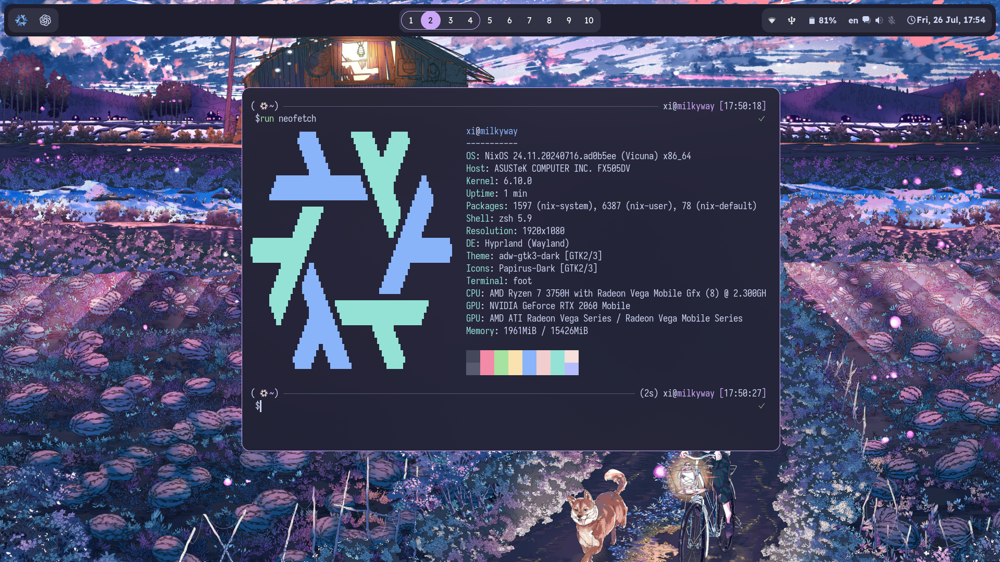
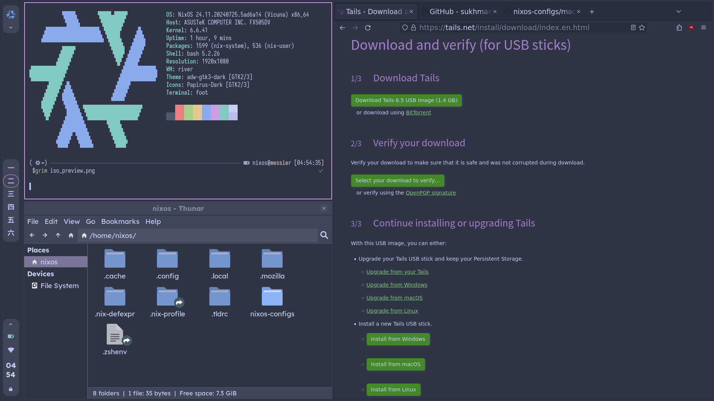

<p id="preview" align="center">
  <br/>
  
  Laptop (milkyway)
  
  ISO (messier)
  <br/>
</p>

## Todo

### Completed 🎉

- [x] **AGS** - Add system(+)
- [x] **Hyprland** - Custom & dynamic colors
- [x] **System-wide dynamic colors** - Background, text, accent, overlay, secondary text
- [x] **Anyrun** - Custom dynamic colors
- [x] **GTK** - Fully dynamic custom themes
- [x] **Starship** - Auto-updating `starship.toml` using perl script
- [x] **Portable Workstation** - River, Waybar
- [x] **Foot, Dunst, Mako**
- [x] **Newsboat** - Add Rofi, lynx, vim, imv, pdf, browser, mpv, mpv loop, mpv float integration
- [x] **Terminal Tools** - git, gh, lazygit, eza, btop, bat, nix-init, nix-index, fzf, ...
- [x] **Zathura** - Custom colorscheme with hash codes.

### In Progress 🚧

- [ ] **Tailnet** - TailScale, WireGuard, ...
- [ ] **IDS** - lynis, vulnix
- [ ] **IDE** - VSCode, Neovim, ...
- [ ] **Rofi** - Custom colors
- [ ] **Credit More Gracefully** - Add Name, Repo, etc.
- [ ] **ZFS** - Switch to ZFS
- [ ] **Hardened Systemd**
- [ ] **Modularize** - Anyrun, qt.nix, ...
- [ ] **QT**
- [ ] **fastfetch** - Add custom colors (How?)
- [ ] **Refactor** - Remove dead code, unused files, ...
- [ ] **Templates** - Add flake templates for c, cpp, python, node, ...
- [ ] **Server (messier)** - nginx, mailserver, vaultwarden, monitoring tools, forgejo, ...

## Privacy and Security

<details>

<summary>🛡️ Measures</summary>

</br>

- **Firewall** - `nftables`
- **DNS** - `adguard`
- **VPN** - `wireguard`
- **Secrets** - `agenix`
- **Encryption** - `LUKS`
- **Sandboxing** - `firejail`
- **Security Profiles** - `apparmor`, `selinux`
- **Physical Security** - `yubikey`
- **Ban IPs** - `fail2ban`
- **Malware scanner** - `clamav`
- **USB Device Control** - `usbguard`
- **Software auditing** - `lynis` `vulnix` `auditd`
- **Hardened Firefox** - `Schizofox`
- **Stateless System** - `Impermanence`
- **Kernel Hardening**

</details>

## Host

Following hosts are available:

| Host         | Type    |
| ------------ | ------- |
| `milkyway`   | Laptop  |
| `triangulum` | Server  |
| `andromeda`  | Desktop |
| `messier`    | ISO     |

## Tools

Here are the tools I am using:

| Tool               | Milkyway/Andromeda | Messier       |
| ------------------ | ------------------ | ------------- |
| 🪟 Window Manager  | Hyprland           | River         |
| 🖥️ Display Manager | swaylock           | swaylock      |
| 📊 Bar             | AGS                | Waybar        |
| 🚀 Launcher        | Anyrun, Rofi       | Rofi          |
| 🎨 GTK Theme       | adw-gtk3-dark      | adw-gtk3-dark |
| 🖥️ Terminal        | Foot               | Foot          |
| 🔔 Notifications   | Dunst, AGS         | Mako          |

> [!NOTE]
> **Triangulum** is a headless server, so no graphical stuff there.

## Color Scheme

### Default Color Scheme: `cappuccino-mocha`

| Element                                                    | Color Name | Hex Code  |
| ---------------------------------------------------------- | ---------- | --------- |
| Background Color                                           | base00     | `#1e1e1e` |
| Secondary Background Color                                 | base02     | `#313244` |
| Text Color                                                 | base05     | `#cdd6f4` |
| Secondary Text Color                                       | base00     | `#1e1e1e` |
| Accent Color (Button focused, Border color, Button active) | base0E     | `#cba6f7` |
| Overlay Color (Button hover, Button disabled)              | base03     | `#45475a` |

### Available Color Schemes

| Scheme             | Variants                                                                                            |
| ------------------ | --------------------------------------------------------------------------------------------------- |
| `cappuccino`       | mocha, frappe                                                                                       |
| `dracula`          | -                                                                                                   |
| `gruvbox`          | light, dark, medium, hard                                                                           |
| `henna`            | -                                                                                                   |
| `helios`           | -                                                                                                   |
| `horizon`          | dark                                                                                                |
| `nord`             | -                                                                                                   |
| `monokai`          | -                                                                                                   |
| `selenized`        | dark, light                                                                                         |
| `solarized`        | dark, light                                                                                         |
| `tomorrow-night`   | -                                                                                                   |
| `twilight`         | -                                                                                                   |
| `ubuntu`           | -                                                                                                   |
| `uwunicorn`        | -                                                                                                   |
| `windows-95`       | -                                                                                                   |
| `doom-one`         | -                                                                                                   |
| `alph`             | -                                                                                                   |
| `ashes`            | -                                                                                                   |
| `atelier`          | cave, dune, estuary, forest, heath, lakeside, meadow, plateu, savanna, seaside, studio, sulphurpool |
| `ayu-dark`         | -                                                                                                   |
| `bespin`           | -                                                                                                   |
| `caret`            | -                                                                                                   |
| `darkmoss`         | -                                                                                                   |
| `ember`            | -                                                                                                   |
| `emil`             | -                                                                                                   |
| `eris`             | -                                                                                                   |
| `eva`              | -                                                                                                   |
| `everforest`       | -                                                                                                   |
| `fairy-floss`      | -                                                                                                   |
| `gigavolt`         | -                                                                                                   |
| `io`               | -                                                                                                   |
| `isotope`          | -                                                                                                   |
| `manegarm`         | -                                                                                                   |
| `material-vivid`   | -                                                                                                   |
| `miramare`         | -                                                                                                   |
| `monokai`          | -                                                                                                   |
| `oceanic-next`     | -                                                                                                   |
| `old-hope`         | -                                                                                                   |
| `outrun-dark`      | -                                                                                                   |
| `spaceduck`        | -                                                                                                   |
| `stella`           | -                                                                                                   |
| `summerfruit-dark` | -                                                                                                   |
| `woodland`         | -                                                                                                   |
| `xcode-dusk`       | -                                                                                                   |

## Installation

### Disk Partitioning

Here is what our disk partitioning will look like:

```plaintext
+-----------------------+------------------------+-----------------------+
| Boot partition        | Swap partition         | LUKS encrypted root   |
|                       |                        | partition             |
|                       |                        |                       |
| /boot                 | [SWAP]                 | /                     |
|                       |                        |                       |
|                       |                        | /dev/mapper/crypted   |
|                       |                        |                       |
| /dev/sda1             | /dev/sda2              | /dev/sda3             |
|                       |                        |                       |
| 1GB                   | 8GB                    | Remaining space       |
+-----------------------+------------------------+-----------------------+
```

<details>

<summary>Option 1 - Partition and mount the drives using disko</summary>

</br>

```bash
# Change the disk id according to your system
DISK='/dev/disk/by-id/ata-Samsung_SSD_870_EVO_250GB_S6PENL0T902873K'

curl https://raw.githubusercontent.com/sukhmancs/nixos-configs/main/disko/luks-btrfs-subvolumes/default.nix \
-o /tmp/disko.nix
sed -i "s|to-be-filled-during-installation|$DISK|" /tmp/disko.nix
nix --experimental-features "nix-command flakes" run github:nix-community/disko\
-- --mode disko /tmp/disko.nix
```

</details>

<details>

<summary>Option 2 - Manual Partitioning</summary>

</br>

**Create Partitions**

```bash
# Create boot, swap, and root partitions
DISK=/dev/sda

parted "$DISK" -- mklabel gpt
parted "$DISK" -- mkpart ESP fat32 1MiB 1GiB
parted "$DISK" -- set 1 boot on

parted "$DISK" -- mkpart Swap linux-swap 1GiB 9GiB

parted "$DISK" -- mkpart primary 9GiB 100%
```

**Setup Swap Partition**

```bash
mkswap -L SWAP "$DISK"2
swapon "$DISK"2
```

**Btrfs with LUKS (Root Partition)**

```bash
cryptsetup --verify-passphrase -v luksFormat "$DISK"3 # /dev/sda3
cryptsetup open "$DISK"3 crypted

mkfs.btrfs -L NIXOS /dev/mapper/crypted

mount -t btrfs /dev/mapper/crypted /mnt

# Setups subvolumes
btrfs subvolume create /mnt/root
btrfs subvolume create /mnt/home
btrfs subvolume create /mnt/nix
btrfs subvolume create /mnt/persist
btrfs subvolume create /mnt/log

# Blank snapshot of the root subvolume
btrfs subvolume snapshot -r /mnt/root /mnt/root-blank

# Unmount the root partition
umount /mnt

# Create mount points
mkdir /mnt/home
mkdir /mnt/nix
mkdir /mnt/persist
mkdir -p /mnt/var/log

# Mount the subvolumes
mount -o subvol=root,compress=zstd,noatime /dev/mapper/crypted /mnt
mount -o subvol=home,compress=zstd,noatime /dev/mapper/crypted /mnt/home
mount -o subvol=nix,compress=zstd,noatime /dev/mapper/crypted /mnt/nix
mount -o subvol=persist,compress=zstd,noatime /dev/mapper/crypted /mnt/persist
mount -o subvol=log,compress=zstd,noatime /dev/mapper/crypted /mnt/var/log
```

**Setup Boot Partition**

```bash
mkfs.vfat -n BOOT "$DISK"1
mount --mkdir "$DISK"1 /mnt/boot
```

</details>

### Install NixOS

```bash
# Generate the configuration
nixos-generate-config --root /mnt
```

> [!NOTE]
>
> If impermanence is enabled, we need to add the `neededForBoot = true` to some
> mounted subvolumes in hardware-configuration.nix. It will look something like
> this:
>
> ```nix
> fileSystems."/persist" = {
>    device = "/dev/disk/by-uuid/b79d3c8b-d511-4d66-a5e0-641a75440ada";
>    fsType = "btrfs";
>    options = ["subvol=persist"];
>    neededForBoot = true; # <- add this
>  };
>
>  fileSystems."/var/log" = {
>    device = "/dev/disk/by-uuid/b79d3c8b-d511-4d66-a5e0-641a75440ada";
>    fsType = "btrfs";
>    options = ["subvol=log"];
>    neededForBoot = true; # <- add this
>  };
> ```

Run `nixos-install` to install NixOS.

### Install the dotfiles

```bash
git clone https://this.repo.url/ ~/.config/nixos-configs
cd ~/.config/nixos-configs
```

> [!CAUTION]
> If <strong>Impermanence is enabled</strong>, ensure that the password
> files are located in a volume marked with `neededForBoot = true` otherwise the
> user will not be able to login.
>
> ```bash
> mkdir -p /persist/passwords/root /persist/passwords/<user>
> mkpasswd -m sha-512 > /persist/passwords/<user>
> mkpasswd -m sha-512 > /persist/passwords/root
> ```

```bash
nixos-rebuild switch --flake .#<host>
```

## Thanks to these amazing people

- [MatthiasBenaets](https://github.com/MatthiasBenaets/nix-config/)
- [raf](https://github.com/notashelf/nyx)
- [end-4](https://github.com/end-4/dots-hyprland)
- [aylur](https://github.com/Aylur/dotfiles/)
- will add more


## Credit and Attribution

I don't mind people copying my code, so you don't have to give credit to me. Howevever, please make sure that you give credit to the original authors of the code that I have used in this repository.